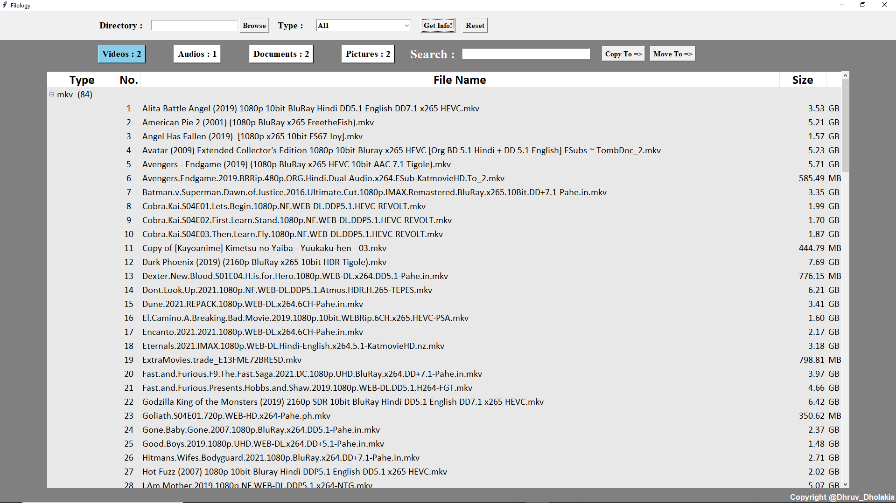

# Filology

It is a simple Tkinter based file management GUI.


## Features

- Browse Directories
- Filter files by type [Videos, Audios, Documents, Pictures]
- Filter files by extensions [mp4, wmv, aac, txt ...]
- Sort files by name
- Sort files by size
- Open selected file
- Copy or Paste multiple files by selection
- Copy and Paste dialog box with progress indicator and total size of selected files
- Search files by name with autoscroll
- Count of matched results when searching
- Cross platform


## Dependencies

- tkinter 
- shutil
## Deployment

To deploy this project run

```bash
  filology.py   // First install all neccessary dependencies listed above.
```
or
```bash
  Filology.exe
```
## Demo

Link to demo

https://www.linkedin.com/posts/dhruvdholakia99_simple-file-based-project-made-with-tkinter-activity-6730786229681487872-qW_K?utm_source=linkedin_share&utm_medium=member_desktop_web


## Screenshots



## Lessons Learned

Getting file info was easy but presenting them with GUI was tough.
Events handling with tkinter was a bit tricky but all the help was available on the net.
System level Copy and Paste live progress information is not available in this build but it manages to show the progress info with number of processed files. 

## Authors

- [@DhruvDholakia](https://www.github.com/DhruvDholakiaCE)


